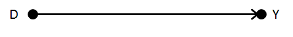
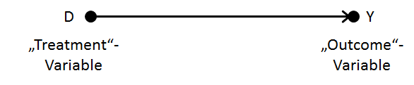

```{r setup, include=FALSE}

#When PDF is not complied:
  #if(!require("tinytex")) install.packages("tinytex") 
  #library(tinytex)
    # tlmgr_search('/times.sty')   # search for times.sty
    # tlmgr_install('psnfss')      # install the psnfss package

  #update alle R & LaTex packages if nothing else helps:
    # update.packages(ask = FALSE, checkBuilt = TRUE) # upadte every R package
    # tlmgr_update()               # update every LateX package

# show additional messages to help you debug the problem:
  options(tinytex.verbose = TRUE) # RMD: command within a chunk // LaTex: run command before you compile the document

# if(!require("installr")) install.packages("installr")
#  library(installr)
#  updateR()
#if(!require("tidyverse")) install.packages("tidyverse") 
  #library(tidyverse) # for fill() 
#if(!require("formatR")) install.packages("formatR")
  library(formatR)
#if(!require("styler")) install.packages("styler")
#  library(styler)
library(knitr)
knitr::opts_chunk$set(echo = T,
                      eval = T)
                      #tidy=TRUE, 
                      #tidy.opts=list(width.cutoff=60))
```

### Content

\tableofcontents[]

<!-- ----------------------- NEXT CHAPTER --------------------------------- -->

# I. Causal Hypotheses

<!-- --------------------- NEW SLIDE ------------------------------- -->

### "Simple" causal hypotheses

"Simple" causal hypotheses with two feature:

-   Graphic representation of a "simple" hypothesis: causal effect of a feature D on a feature Y



| **D**                | **Y**              |
|----------------------|--------------------|
| Treatment variable   | Outcome variable   |
| Explanatory variable | Explained variable |
| Independent variable | Dependent variable |

<!-- --------------------- NEW SLIDE ------------------------------- -->

### Criteria for causal inference (D on Y)

1.  Distinct theoretical constructs: No definitional dependency between D and Y
2.  Appropriate operationalizations and measurement of both features: features → variables
3.  Theoretical plausibility: Qualitative explanation (→ mechanism) of the causal effect necessary; reference to empirical studies not sufficient!
4.  Appropriate temporal order: Theoretical justification needed (empirical order not sufficient, since anticipation effects can occur)
5.  Appropriate temporal distance: Some effects take time to unfold and some effects weaken over time (theoretical justification needed)
6.  Identification of the causal effect: E.g. by DAG
7.  Empirical association: E.g. by regression analysis

<!-- ----------------------- NEXT CHAPTER --------------------------------- -->

# II. The counterfactual causal model

<!-- --------------------- NEW SLIDE ------------------------------- -->

### History and basic idea

**History**

▸ First approaches: John Stuart Mill 1843 & Gustav Theodor Fechner 1860)

▸ Formal concepts of experimental designs in statistics: Neyman 1923 & Fisher 1935

▸ Formalized causal analysis: Donald B. Rubin 1974, 1977 & 1978

**Basic idea**

▸ Focus on the causality concept "Estimating the causal effect of D on Y"

▸ Based on experimental language: almost any situation can be described in non-experimental context at least as a thought experiment

**Other names:**

▸ Potential Outcome Model (POM)

▸ Rubin Causal Model (RCM)

▸ Modern Causal Analysis (MCA)

<!-- --------------------- NEW SLIDE ------------------------------- -->

### Definitions of treatment and outcomes



**Simplified version of a binary "Treatment":**

▸ D=1: Treatment ("Experimental group")

▸ D=0: No Treatment ("Control group")

Note: *The binary treatment assumption is a simplistic assumption; There are counterfactual causal models with polytomic treatments (nominal, ordinal, metric).*

<!-- --------------------- NEW SLIDE ------------------------------- -->

### Central assumption for outcome Y


Each individual **i** can be observed in two potential states
(depending on a potential treatment), which means that
**two potential outcomes** are conceivable for each person i,
regardless of the actual treatment status:
▸ Y\<sub\>i\</sub\>\<sup\>0\</sup\>= potential outcome for person i in the case without the treatment
▸ Y\<sub\>i\</sub\>\<sup\>1\</sup\>= potential outcome for person i in the case of the treatment
Note: *The outcome is generally viewed as metric, but other
scale levels can also be assumed.*

<!-- ----------------------- NEXT CHAPTER --------------------------------- -->

# III. The naive estimator

<!-- --------------------- NEW SLIDE ------------------------------- -->

<!-- ----------------------- NEXT CHAPTER --------------------------------- -->

# IV. Directed Acyclic Graphs (DAGs)

<!-- --------------------- NEW SLIDE ------------------------------- -->

<!-- ----------------------- NEXT CHAPTER --------------------------------- -->

# V. Experimental vs. non-experimental designs

<!-- --------------------- NEW SLIDE ------------------------------- -->
### End of the Preview


### Literature
